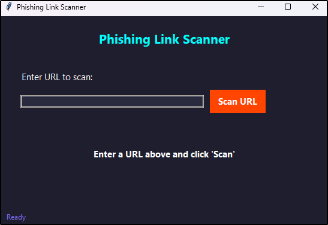

# Phishing Link Scanner

A **Python-based phishing link scanner** with a **Graphical User Interface (GUI)** built using **Tkinter**. This tool helps users detect potentially malicious URLs using **Google Safe Browsing API** and heuristic analysis.

## 🚀 Features
- ✅ **Google Safe Browsing API Integration**
- ✅ **Heuristic Analysis for Phishing Patterns**
- ✅ **Domain Spoofing Detection**
- ✅ **Easy-to-Use GUI (Tkinter)**
- ✅ **Real-time URL Scanning**

## 🛠 Installation

### **Step 1: Clone the Repository**
```bash
git clone https://github.com/yourusername/phishing-link-scanner.git
cd phishing-link-scanner
```

### **Step 2: Install Dependencies**
```bash
pip install requests validators tldextract
```

### **Step 3: Get Google Safe Browsing API Key**
1. Visit **[Google Cloud Console](https://console.cloud.google.com/)**.
2. Enable **Google Safe Browsing API**.
3. Generate an **API Key**.
4. Replace `YOUR_GOOGLE_SAFE_BROWSING_API_KEY` in `phishing scanner.py`.

## 📌 Usage

### **Run the Scanner**
```bash
python phishing_scanner.py
```

### **How It Works:**
1. Enter a **URL** in the text field.
2. Click **"Scan URL"**.
3. The scanner checks:
   - **Google Safe Browsing API** (to detect known phishing sites).
   - **Heuristic Analysis** (to identify phishing patterns, suspicious keywords, and domain spoofing).
4. Displays **safe, suspicious, or dangerous** results.

## 🖥️ GUI Preview


## 📌 Example Outputs

- **🟢 Safe URL:** `No phishing indicators found.`
- **🟠 Suspicious URL:** `URL contains phishing characteristics.`
- **🔴 Phishing URL:** `URL is flagged as a phishing site!`

## 🛡️ Future Enhancements
- 🔹 Add **VirusTotal API** integration
- 🔹 Implement **real-time threat database updates**
- 🔹 Support **bulk URL scanning**
- 🔹 Enhance **logging system** for tracking

## 🤝 Contributing
Pull requests are welcome! If you have feature requests or find any bugs, open an **issue**.

## 📝 License
This project is licensed under the **MIT License**.

---
### 👨‍💻 Developed by [Aenosh Rajora]
🔗 **GitHub:** [aenoshrajora](https://github.com/aenoshrajora)

